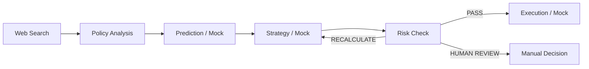

# Prototype

## Prototype purpose

The prototype tests how Trading Brain could work as a risk-warning and human-review layer around an existing electricity trading workflow. It is not a production trading system and does not autonomously submit a declaration.

## Current workflow

Trading Brain keeps the existing prediction, strategy, and execution responsibilities separate. Its own contribution is to gather time-aware evidence, interpret policy constraints, identify possible market anomalies, and determine when human review should interrupt the automated path.

## Interface areas

**Today’s Warning** is the alert-first entry point. It should show the review status, risk summary, affected periods, reason for the warning, and the available next action.

**Transaction Flow** shows how the workflow moves from search and policy analysis through prediction, strategy, risk checking, and possible submission.

**Key Evidence** lets the trader inspect source, publication time, region, evidence type, matched signal, and limitations. Evidence should be separated into live event evidence, candidate evidence, background references, and unavailable information.

**History Replay** supports offline review of previous cases. The May 25-27 case can be used to inspect how the system would have identified a change in price and spread behaviour, while keeping later market data separate from what was knowable at the original decision time.

**Annotation and evaluation** record whether the warning was useful, whether the affected period was correct, and what the trader decided. These records can support later review and model improvement.

## Integration direction

The enterprise prediction, strategy, and execution agents may replace the current mock modules through adapters. Trading Brain would remain a separate warning and risk layer with stable inputs and outputs such as alert level, signals, evidence, risk status, recommended actions, and an execution gate.

## Current limitations and next tests

The current prototype still needs better time-stamped and Guangdong-specific evidence, confirmation of enterprise API contracts, and testing with domain participants. Future testing should ask whether users can explain why an alert appeared, identify relevant evidence, choose an appropriate intervention, and notice when the system is uncertain or wrong.

## Enterprise field reference

企业合作方可以查看[每日风险简报企业对接说明](enterprise-integration.md)，其中包含在线调用方式、前端展示字段、状态解释、证据时间、交易员反馈和失败重试规则。
